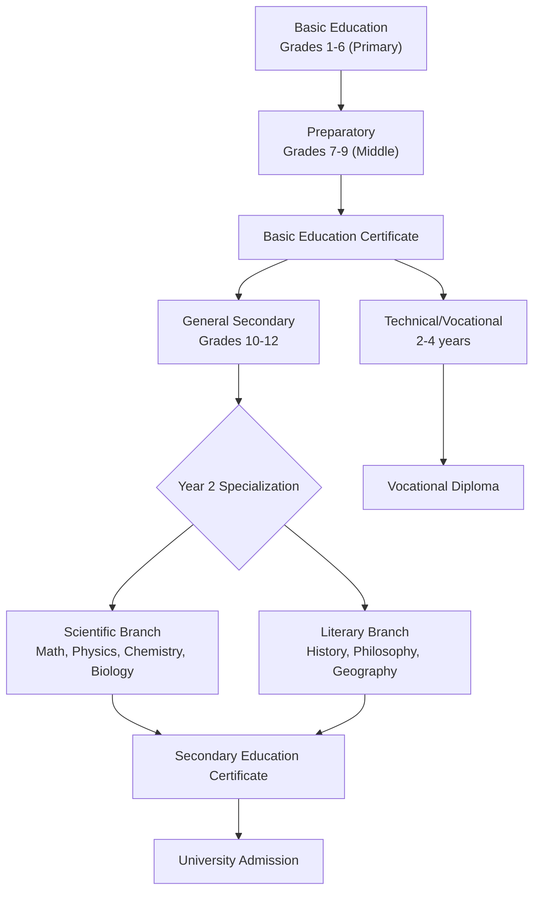
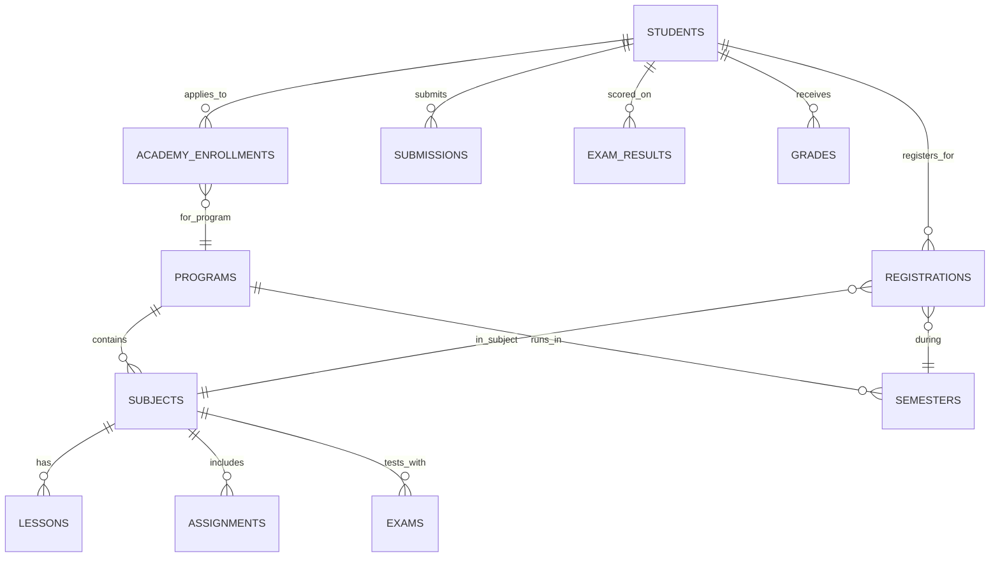
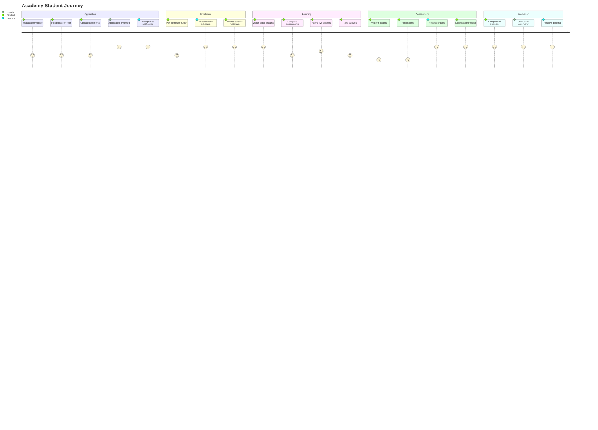

# EduLibya: Online Academy + Student Profile Enhancement — Complete Study & Plan

## Executive Summary

This document covers **three interconnected initiatives** that should be tackled in order:

1. **Student Profile Enhancement** — Improve the existing student dashboard with course progress, video resume position tracking, and enrolled course links
2. **UI/Layout Redesign** — Rework the platform's navigation and layout to cleanly accommodate two products (Course Marketplace + Online Academy) without confusion
3. **Online Academy System** — A structured, degree-granting educational program alongside the existing course marketplace

---

## Part 1: Student Profile Enhancement (Immediate Priority)

### What We Already Have
Your database already tracks student progress with two tables:
- **`progress`** — Stores `watchedSeconds` and `isCompleted` per lesson per user
- **`lesson_progress`** — Stores `completed` and `completedAt` per lesson per user
- **`enrollments`** — Stores overall `progress` percentage and `completedAt`

### What's Missing

| Feature | Status | What to Build |
|:--------|:-------|:-------------|
| Course progress per lesson | ✅ Schema exists | Frontend display missing |
| Video resume position (timestamp) | ✅ `watchedSeconds` exists in `progress` | Need API endpoint + player integration to save/load resume position |
| Student profile page | ❌ Missing | New `/profile` page showing enrolled courses, progress bars, and resume links |
| "Continue watching" section | ❌ Missing | Dashboard section showing last-watched lesson with "Resume at 12:34" button |

### Proposed Changes

#### Database
- No schema changes needed — `progress.watchedSeconds` already stores the video position

#### API Backend
- `GET /student/progress-summary` — Returns all enrolled courses with per-lesson progress and last `watchedSeconds`
- `PUT /progress/:courseId/:lessonId` — Upsert to save `watchedSeconds` as student watches (debounced every 10 seconds)
- `GET /student/continue-watching` — Returns the last 3 courses the student was actively watching, with exact lesson + timestamp

#### Web Frontend
- **New `/profile` page** — Student profile with avatar, name, enrolled courses grid with progress bars
- **Dashboard enhancement** — "Continue Watching" carousel showing last-watched lessons with resume timestamps
- **Video player** — On mount, seek to saved `watchedSeconds`; on timeupdate (debounced), save position

#### Mobile Frontend
- **Profile tab enhancement** — Add "My Courses" section with progress indicators
- **"Continue Watching" row** on home screen
- **Video player** — Auto-resume from saved position

---

## Part 2: UI/Layout Redesign Strategy

### The Problem
After adding courses, tutoring, live sessions, monetization, ratings, and now potentially an academy — the navigation is cluttered. We need a clear information architecture.

### Proposed Navigation Structure

```
┌─────────────────────────────────────────────────────────┐
│  EduLibya                                               │
├─────────────────────────────────────────────────────────┤
│  [Courses]  [Academy 🎓]  [Tutoring]  [Teachers]       │
│                                                         │
│  Profile Menu: Dashboard | My Courses | Settings        │
└─────────────────────────────────────────────────────────┘
```

#### Key Design Decisions

> [!IMPORTANT]
> **Courses vs Academy Separation**: The Course Marketplace and Online Academy serve completely different purposes and MUST be visually and functionally distinct to avoid user confusion.

| Aspect | Course Marketplace (Current) | Online Academy (New) |
|:-------|:-----|:-----|
| **Purpose** | Part-time learning, skill building | Full degree / diploma program |
| **Structure** | Individual standalone courses | Structured programs with semesters, prerequisites, exams |
| **Enrollment** | Buy any course anytime | Apply → Admission → Semester enrollment |
| **Duration** | Self-paced, no deadline | Fixed academic calendar (semesters) |
| **Assessment** | Optional quizzes | Mandatory exams, graded assignments, GPA |
| **Credential** | Completion certificate | Diploma / Degree |
| **Teachers** | Any verified teacher | Academy-approved faculty |

### Navigation Changes
1. **Home page** — Split hero into two paths: "Browse Courses" and "Apply to Academy"
2. **Top nav** — Add "Academy 🎓" link between Courses and Tutoring
3. **Student Dashboard** — Add tabs: "My Courses" | "Academy Program" (if enrolled)
4. **Mobile bottom tabs** — Consider replacing or adding an Academy tab

---

## Part 3: Complete Online Academy Study

### A. What Online Schools Exist Today

#### International Models Available to Libyan Students

| School | Type | Accreditation | Cost/Year | Notes |
|:-------|:-----|:-------------|:----------|:------|
| **Forest Trail Academy** | US High School | Cognia, MSA-CESS | ~$1,500 | American diploma, accepts international students |
| **Excel High School** | US High School | Regionally accredited | ~$1,200 | Self-paced, college dual-enrollment available |
| **EduWW** | US High School | WASC | ~$2,000 | International focus |
| **ASU Prep Digital** | US High School + College | Arizona State | ~$5,000 | Dual enrollment, university credits |
| **Liberty University Online** | US High School + College | SACSCOC | ~$3,000 | Associate degree while in high school |
| **Khan Academy** | Free supplementary | None (not a school) | Free | Study aid only, no diploma |
| **Coursera/edX** | University courses | Varies | $300-1000/course | Certificates, some degrees |

#### What's Missing in the Libyan Market

> [!TIP]
> **Market Opportunity**: There is NO Libyan-language online academy offering a structured secondary education program with the Libyan curriculum. All existing options are in English and follow Western curricula. EduLibya could be the FIRST Arabic-language online academy following the Libyan educational framework.

### B. Libyan Education System Structure



#### Core Subjects in Libyan Secondary School

**All Students (Year 1):**
- Islamic Education | Arabic Language | English Language | Mathematics
- History | Geography | Physics | Chemistry | Biology
- Art | Physical Education

**Scientific Branch (Years 2-3):**
- Advanced Mathematics (Algebra, Geometry, Trigonometry)
- Physics | Chemistry | Biology

**Literary Branch (Years 2-3):**
- History | Geography | Philosophy | Sociology

### C. Proposed Academy Architecture

#### Database Schema (New Tables Needed)

```
academy_programs       → "General Secondary - Scientific", "General Secondary - Literary"
academy_semesters      → Fall 2026, Spring 2027, etc. (with start/end dates)
academy_subjects       → "Mathematics 10", "Physics 11", linked to program + grade level
academy_enrollments    → Student enrollment in a program (admission status, current grade)
academy_registrations  → Student registered for specific subjects in a semester
academy_assignments    → Homework, essays, projects
academy_submissions    → Student work submitted for grading
academy_grades         → Per-subject grades with GPA calculation
academy_transcripts    → Generated transcript records
academy_exams          → Formal exam sessions (midterm, final)
academy_exam_results   → Scored exam results
academy_attendance     → Track attendance for live classes
```

#### Key Relationships



### D. How Academy and Courses Coexist Without Conflict

> [!WARNING]
> **Critical Architecture Decision**: The Academy MUST NOT reuse the existing `courses` table. Academy subjects are fundamentally different from marketplace courses.

#### Separation Strategy

| Layer | Course Marketplace | Online Academy |
|:------|:-------------------|:---------------|
| **Database tables** | `courses`, `enrollments`, `lessons` | `academy_*` tables (all prefixed) |
| **API routes** | `/api/courses/*` | `/api/academy/*` (completely separate router) |
| **User roles** | `student`, `teacher` | Add: `academy_student`, `faculty`, `registrar` |
| **Frontend routes** | `/courses/*` | `/academy/*` |
| **Payment model** | Per-course purchase | Semester tuition (can be installments) |
| **Content** | Teacher uploads videos | Faculty creates structured curriculum |

#### What IS Shared
- **User accounts** — Same login for both, with expanded role field
- **Authentication** — Same JWT token system
- **Video infrastructure** — Same HLS encrypted streaming
- **Payment gateway** — Same payment system, different products
- **Notification system** — Same infrastructure

### E. Academy Student Journey



### F. Implementation Phases

#### Phase 1: Student Profile Enhancement (1-2 weeks)
- Video resume position tracking
- Student profile page with course progress
- "Continue Watching" feature

#### Phase 2: UI/Layout Redesign (1 week)
- Restructure navigation for dual-product platform
- Update Home page with Academy section
- Redesign student dashboard with tabs

#### Phase 3: Academy Foundation (2-3 weeks)
- Database schema for programs, subjects, semesters
- Academy landing page + application form
- Admin panel: manage programs, review applications
- Academy student dashboard

#### Phase 4: Academy Learning (2-3 weeks)
- Subject content (lectures, materials)
- Assignment submission and grading
- Live class scheduling (reuse existing live sessions)
- Attendance tracking

#### Phase 5: Academy Assessment (2-3 weeks)
- Formal exam system (timed, proctored option)
- Grade book and GPA calculation
- Transcript generation (PDF)
- Progress reports for parents/guardians

#### Phase 6: Academy Launch & Polish (1-2 weeks)
- Testing, QA
- Notification system for deadlines
- Parent portal (optional)

---

## User Review Required

> [!IMPORTANT]
> **Key Questions Before Proceeding:**
>
> 1. **Start with Phase 1 first?** — I recommend starting with the Student Profile Enhancement since it improves the existing platform immediately and doesn't require the major academy infrastructure.
>
> 2. **Libyan or International Curriculum?** — Should the academy follow the official Libyan curriculum (grades 10-12 with Scientific/Literary branches)? Or offer an American/international diploma? Or both?
>
> 3. **Testing Model** — You mentioned "maybe come for testing." Should we build:
>    - **Option A**: Fully online exams (with timer + anti-cheating measures)
>    - **Option B**: Online learning + in-person exam scheduling (book an exam slot at a physical location)
>    - **Option C**: Hybrid (minor quizzes online, major exams in-person)
>
> 4. **University/College** — Is the university component for Phase 1 or a future phase? University programs are significantly more complex (credit hours, majors, electives, prerequisites).
>
> 5. **Accreditation** — Are you planning to partner with the Libyan Ministry of Education for official recognition? This would affect how we structure the grading and transcript system.

## Verification Plan

### Phase 1 Verification
- Run the app, enroll in a course, watch a video, close browser, reopen → video resumes at exact timestamp
- Check student profile page shows all enrolled courses with accurate progress bars
- Verify "Continue Watching" section appears on dashboard

### Phase 2 Verification
- Navigate between Courses and Academy sections — confirm they are clearly separate
- Test responsive design on mobile
- Verify no broken links or navigation regressions

### Phase 3+ Verification
- End-to-end application → admission → enrollment → learning → exam → grade → transcript flow
- Admin can manage programs, approve applications, post grades
- Transcript PDF generates correctly
